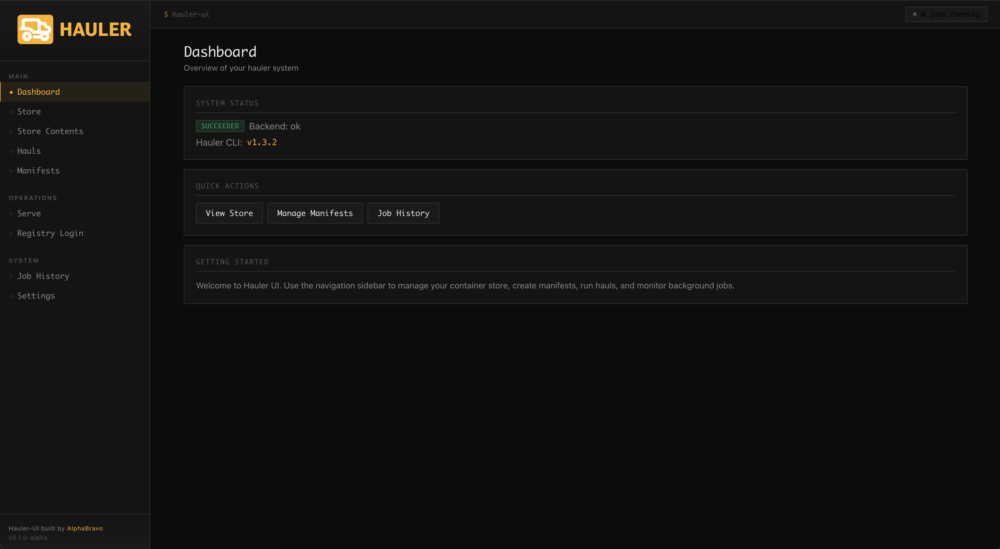

# Hauler UI by AlphaBravo

<p align="center">
  
</p>

A beginner-friendly web interface for [Rancher Government Hauler](https://github.com/rancherfederal/hauler) — the airgap content orchestration tool.

**NOTE**: This project is in ALPHA while we test it. We will release a stable version in the coming weeks.

## Overview

Hauler UI is a **single-container web application** that provides full operational parity with the Hauler CLI. It wraps the power of Hauler's command-line interface in an intuitive graphical experience, making airgap operations accessible to users of all skill levels.

### Key Features

- **Store Operations** — Add images, charts, and files to your store; sync registries; save/load archives; extract content
- **Registry Management** — Login/logout to Docker Hub, GHCR, and other container registries
- **Serve Operations** — Start an embedded container registry or HTTP fileserver
- **Job Management** — Background task execution with streaming logs and job history
- **Manifest Management** — Create and edit Hauler manifests with Monaco editor
- **Authentication** — Optional password-based UI access control
- **Single Container** — Everything packaged in one Alpine-based image for simple deployment

## Quick Start

### Docker (Recommended)

```bash
# Run with default configuration
docker run -d \
  --name hauler-ui \
  -p 8080:8080 \
  -v hauler-data:/data \
  ghcr.io/rancherfederal/hauler-ui:latest

# Or use Docker Compose
docker-compose -f deploy/docker-compose.yml up -d
```

Access the UI at `http://localhost:8080`

### First Steps

1. **Open the UI** — Navigate to `http://localhost:8080` in your browser
2. **Configure Hauler** — Set global flags in Settings if needed
3. **Login to a Registry** — Use the Registry page to authenticate (e.g., Docker Hub)
4. **Add Content** — Go to Store → Add, and add an image, chart, or file
5. **Save Your Store** — Use Store → Save to create a portable archive

## Development

### Prerequisites

- **Go** 1.24+
- **Node.js** 20+
- **Make** (optional, for convenience commands)

### Project Structure

```
hauler-ui/
├── backend/           # Go backend server
│   └── internal/      # Internal packages
│       ├── auth/      # Authentication & sessions
│       ├── config/    # Configuration management
│       ├── hauler/    # Hauler CLI integration
│       ├── jobrunner/ # Background job execution
│       ├── manifests/ # Manifest CRUD operations
│       ├── registry/  # Registry login/logout
│       ├── serve/     # Registry & fileserver serving
│       ├── settings/  # Global settings management
│       ├── sqlite/    # Database operations
│       └── store/     # Store operations
├── web/               # React frontend
│   └── src/
│       ├── components/ # Reusable UI components
│       ├── contexts/   # React Context providers
│       ├── pages/      # Page components
│       └── lib/        # Utilities and API client
└── deploy/            # Deployment configurations
```

### Running Locally

```bash
# Install dependencies
make deps

# Run backend (terminal 1)
cd backend && go run .

# Run frontend (terminal 2)
cd web && npm run dev

# Access at http://localhost:5173
```

### Build Commands

```bash
# Build everything
make build

# Build backend only
make build-backend

# Build frontend only
make build-frontend

# Run tests
make test

# Lint code
make lint
```

## Configuration

Hauler UI is configured via environment variables:

| Variable | Default | Description |
|----------|---------|-------------|
| `PORT` | `8080` | HTTP server port |
| `HAULER_UI_PASSWORD` | (none) | Optional UI password for authentication |
| `HAULER_LOG_LEVEL` | `info` | Hauler CLI log level (debug, info, warn, error) |
| `HAULER_IGNORE_ERRORS` | `false` | Continue operations despite errors |
| `HAULER_RETRIES` | `3` | Number of retries for failed operations |
| `HAULER_DIR` | `/data` | Hauler working directory |
| `HAULER_STORE_DIR` | `/data/store` | Store directory path |
| `HAULER_TEMP_DIR` | `/data/tmp` | Temporary files directory |
| `DOCKER_CONFIG` | `/data/.docker` | Docker auth config directory |
| `DATABASE_PATH` | `/data/app.db` | SQLite database path |

> **Source of truth**: See `deploy/.env.example` for the complete list of documented environment variables.

### Persistent Data

All persistent data is stored in `/data`:

- **Hauler store** — Container images, charts, and files
- **SQLite database** — Jobs, settings, and manifests (`app.db`)
- **Docker config** — Registry authentication (`.docker/config.json`)

Mount this directory as a volume to persist data across container restarts.

## Deployment

### Docker Compose

```yaml
services:
  hauler-ui:
    image: ghcr.io/rancherfederal/hauler-ui:latest
    ports:
      - "8080:8080"   # Main UI
      - "5000:5000"   # Registry serve
      - "5001:5001"   # Fileserver serve
    volumes:
      - hauler-data:/data
    environment:
      - HAULER_UI_PASSWORD=your-password  # Optional

volumes:
  hauler-data:
```

### Kubernetes

You can deploy Hauler UI to Kubernetes using the Docker image. Ensure to:

1. Create a PersistentVolumeClaim for `/data`
2. Set environment variables as needed
3. Expose the service on your desired port

Example deployment configuration is available in `deploy/kubernetes/`.

### Building Your Own Image

```bash
# Build multi-stage Docker image
make docker-build

# Tag for your registry
docker tag hauler-ui:latest your-registry/hauler-ui:latest

# Push to registry
docker push your-registry/hauler-ui:latest
```

## Architecture

### Backend (Go)

- **Standard library HTTP server** — No external web framework
- **SQLite** — Embedded database for persistence
- **SSE (Server-Sent Events)** — Real-time log streaming
- **Async job runner** — Background process execution

### Frontend (React)

- **React 19.1** — Modern React with hooks
- **Vite 6** — Fast build tool and dev server
- **React Router 7** — Client-side routing
- **Monaco Editor** — VS Code editor for manifests
- **Custom CSS** — Lightweight styling without frameworks

## Contributing

We welcome contributions! Please follow these guidelines:

1. **Write tests** for new functionality
2. **Run `make lint`** before committing
3. **Follow existing code style** and patterns
4. **Update documentation** as needed

## Hauler License

Copyright © 2025 Rancher Government, Inc.

 Licensed under the Apache License, Version 2.0 (the "License");
 you may not use this file except in compliance with the License.
 You may obtain a copy of the License at

     http://www.apache.org/licenses/LICENSE-2.0

 Unless required by applicable law or agreed to in writing, software
 distributed under the License is distributed on an "AS IS" BASIS,
 WITHOUT WARRANTIES OR CONDITIONS OF ANY KIND, either express or implied.
 See the License for the specific language governing permissions and
 limitations under the License.

## Support on Hauler (not the UI)

- **Issues**: [GitHub Issues](https://github.com/rancherfederal/hauler-ui/issues)
- **Documentation**: [Hauler Docs](https://rancherfederal.github.io/hauler/)
- **Community**: [Rancher Government Slack](https://ranchergovernment.slack.com/)

## Support on Hauler UI

- **Issues**: [GitHub Issues](https://github.com/AlphaBravoCompany/hauler-ui/issues)
- **Documentation** [Documentation](https://github.com/AlphaBravoCompany/hauler-ui/tree/main/docs)

## Built by AlphaBravo

AlphaBravo is a SDVOSB Company providing DevSecOps / Cloud / AI solutions to Government and Commercial organizations. We are committed to delivering secure and innovative technology solutions tailored to your needs.

For more information visit us at https://alphabravo.io.